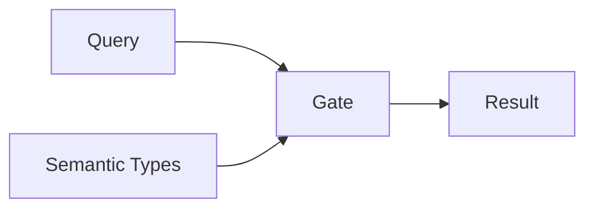

# Mental Model

## A type system for data

Programming languages have type systems that catch errors at compile time:

```
"hello" + 5  →  TypeError: cannot add string to integer
```

Analytical tools don't. They'll happily compute nonsense:

```
AVG(unemployment_rate)  →  17.5%  (wrong answer, no error)
```

**Invariant is a type system for analytical data.** It catches semantic errors at query time—before they produce misleading results.

## How it works

Every column in your data gets a semantic type:

| Type | Example | Can SUM? | Can AVG? |
|------|---------|----------|----------|
| **Measure** | Population count | Yes | Yes |
| **Indicator** | Unemployment rate | No | No |
| **Dimension** | Province name | No | No |

When someone queries `SUM(unemployment_rate)`, Invariant checks the type, sees it's an Indicator, and blocks the query with an explanation.

## Query, Rules, Gate



**Queries:** What the user wants to do—aggregations, filters, joins.

**Semantic Types:** What operations are valid for each column.

**The Gate:** Checks queries against types. Returns one of four verdicts:

- **ALLOW** — Query is valid, execute it
- **WARN** — Query is valid but has caveats, attach disclosures
- **REQUIRE_ACK** — Query is risky, user must acknowledge
- **BLOCK** — Query is invalid, refuse to execute

## Beyond column types

Invariant's type system goes beyond individual columns:

| Concept | What it types | Example error caught |
|---------|---------------|---------------------|
| **Variable roles** | Columns | "Can't sum a percentage" |
| **Universes** | Datasets | "Can't compare all-adults to working-age-adults" |
| **Reference systems** | Geographic boundaries | "Can't join 2011 wards with 2021 wards" |
| **Grain** | Row definitions | "Can't aggregate beyond stored grain" |

## Key vocabulary

| Term | Meaning |
|------|---------|
| **Measure** | An additive fact like a count—can be summed |
| **Indicator** | A derived value like a rate or percentage—cannot be summed |
| **Universe** | The population a dataset describes |
| **Reference System** | A set of geographic or administrative units with versions |
| **Disclosure** | A caveat that must accompany results |

## What Invariant is NOT

- **Not a database** — It doesn't store your data
- **Not a query engine** — It doesn't execute queries
- **Not a visualization layer** — It doesn't render charts

Invariant is pure validation logic. It sits between your catalog and your query engine, deciding what operations are semantically valid.
