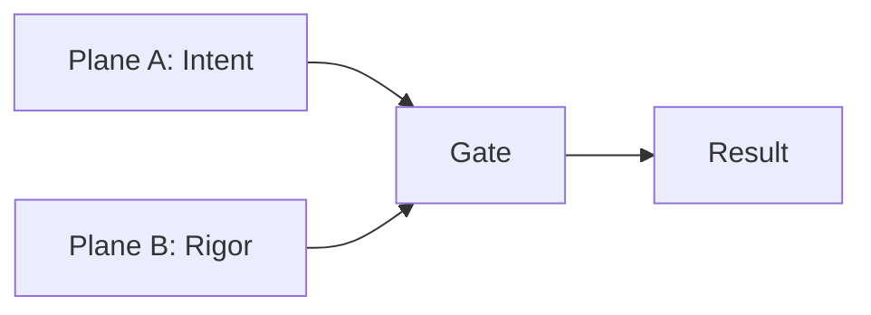

# Mental Model

## The core insight

Analytics errors happen when tools don't know what data means. A dashboard happily sums unemployment rates across regions—producing garbage—because it treats every number as just a number.

Invariant encodes meaning (semantics) so the system can catch mistakes before they reach users.

## Two planes

**Plane A (Dashboard Plane):** What the user wants to do. Queries, aggregations, filters, visualizations.

**Plane B (Rigor Plane):** What the data actually is. Metadata, constraints, rules, semantic definitions.

**The Gate:** Evaluates queries against rules. Returns one of four verdicts:

- **ALLOW** — Query is valid, execute it
- **WARN** — Query is valid but has caveats, attach disclosures
- **REQUIRE_ACK** — Query is risky, user must acknowledge before execution
- **BLOCK** — Query produces nonsense, refuse to execute

## Key vocabulary

| Term | Meaning |
|------|---------|
| Universe | The population a dataset describes (e.g., "all residents" vs "working-age adults") |
| Indicator | A derived value like a rate or percentage—cannot be summed |
| Measure | An additive fact like a count—can be summed |
| Reference System | A set of geographic or administrative units (e.g., "2021 ward boundaries") |
| Disclosure | A caveat that must accompany results (e.g., "data redistributed using area-weighted interpolation") |

## What Invariant is NOT

- **Not a database** — It doesn't store your data
- **Not a query engine** — It doesn't execute queries
- **Not a visualization layer** — It doesn't render charts
- **Not an ETL tool** — It doesn't transform data

Invariant is a validation kernel. It sits between your catalog and your query layer, deciding what operations are semantically valid.

## How to think about it

Think of Invariant as a type system for analytics. Just as a programming language's type system catches "you can't add a string to an integer" at compile time, Invariant catches "you can't sum a percentage" at query time.

The goal is to make invalid states unrepresentable—or at least, unexecutable.
