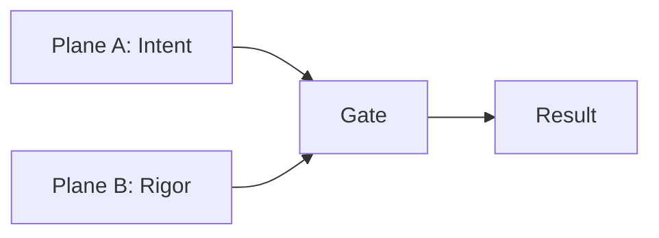

# Mental Model

## The core insight
- …

## Two planes

```mermaid
graph LR
    A[Plane A: Intent] --> Gate
    B[Plane B: Rigor] --> Gate
    Gate --> Result
```

## Key vocabulary

| Term | Meaning |
|------|---------|
| … | … |

## What Invariant is NOT
- …

## How to think about it
- …
