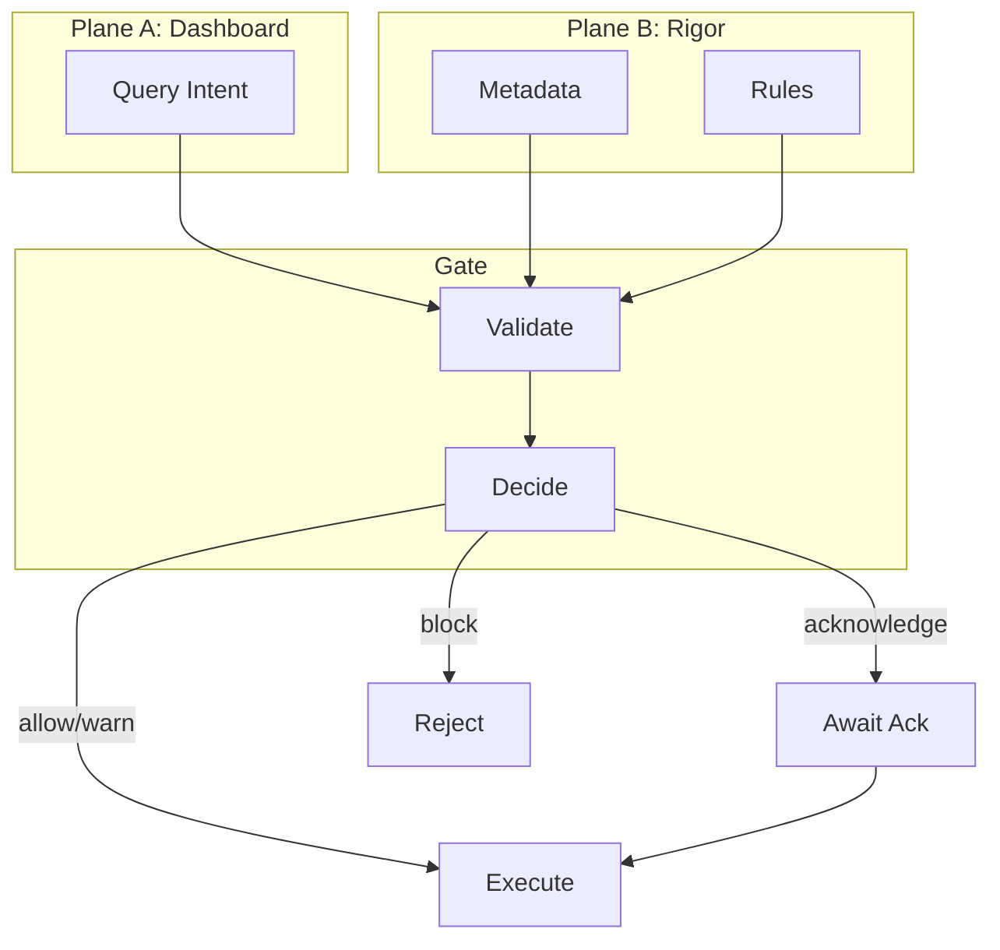

# Two Planes and Gate

The core architectural pattern behind Invariant.

## Overview

Invariant separates analytics into two conceptual planes connected by a validation gate:

## Plane A: The Dashboard Plane

This is where users work:

- Fact tables and indicator tables
- Standard dimensions for slicing
- Filters, aggregations, visualizations
- Fast, interactive, low friction

Plane A is optimized for usability. It doesn't enforce semantic constraints directly.

## Plane B: The Rigor Plane

This is where metadata lives:

- Universe definitions
- Variable semantics (measure vs indicator)
- Reference system versions
- Comparability constraints

Plane B is the source of truth about what operations are valid.

## The Gate

The gate connects the planes:

1. **Receive** a query from Plane A
2. **Evaluate** semantic claims using Plane B metadata
3. **Decide** whether to allow, warn, require acknowledgment, or block
4. **Return** validation result with issues, evidence, and remediations

## Why this separation?

**For users:** Plane A stays fast and intuitive. Semantic constraints are enforced without cluttering the UI.

**For operators:** Plane B metadata can evolve independently. Adding new rules doesn't change the query interface.

**For auditors:** The gate produces structured decisions that can be logged, reviewed, and explained.

## Related concepts

- [Validation Gate](../concepts/validation-gate.md) — Severity levels and disclosures
- [Progressive Rigor](progressive-rigor.md) — How strictness varies by deployment
