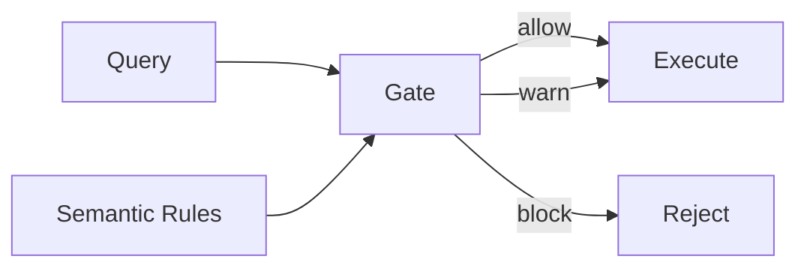
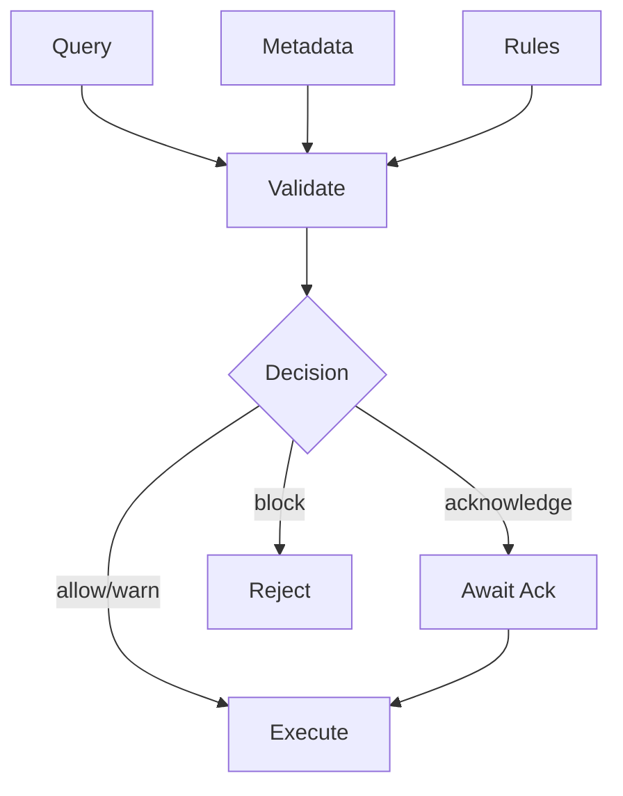

# Query, Rules, Gate

The core architectural pattern behind Invariant.

## Overview

Invariant validates queries against semantic rules before execution:

Three components:

1. **Queries** — What users want to do (aggregations, filters, joins)
2. **Semantic Rules** — What the data means (variable types, universe definitions, constraints)
3. **Validation Gate** — Checks queries against rules, decides whether to proceed

## Queries

This is where users work:

- Select metrics and dimensions
- Apply filters and aggregations
- Build visualizations

Users don't need to know about semantic constraints. They just build queries.

## Semantic Rules

This is where metadata lives:

- **Variable roles** — Is this a measure (can sum) or indicator (cannot sum)?
- **Universe definitions** — What population does this dataset describe?
- **Reference system versions** — Which geographic boundaries apply?
- **Indicator definitions** — How is this derived value computed?

Rules are defined once in the catalog, then enforced automatically.

## Validation Gate

The gate sits between queries and execution:

1. **Receive** a query
2. **Evaluate** it against semantic rules
3. **Decide** — allow, warn, require acknowledgment, or block
4. **Return** validation result with issues, evidence, and remediations

## Why this separation?

**For users:** Queries stay fast and intuitive. Semantic constraints are enforced without cluttering the UI.

**For operators:** Rules can evolve independently. Adding new constraints doesn't change the query interface.

**For auditors:** The gate produces structured decisions that can be logged, reviewed, and explained.

## Related concepts

- [Validation Gate](../concepts/validation-gate.md) — Severity levels and disclosures
- [Progressive Rigor](progressive-rigor.md) — How strictness varies by deployment
