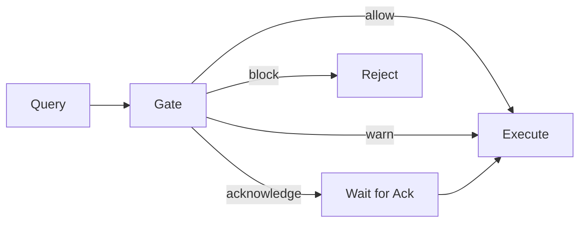

--8<-- "_partials/templates/concept.md"

<!-- Real content -->

# Concept: Validation Gate

How Invariant decides whether to allow, warn, require acknowledgment, or block a query.

## Definition

The **validation gate** is the checkpoint that evaluates semantic claims about a query and decides whether to allow, warn, require acknowledgment, or block execution.

## The gate model

Every query passes through a validation gate that evaluates semantic claims:



## Why it matters

The gate ensures semantic correctness before execution, preventing misleading results from reaching users.

## Severity levels

| Level | Meaning | Behavior |
|-------|---------|----------|
| **Allow** | Query is valid | Execute immediately |
| **Warn** | Valid but includes caveats | Execute with disclosures |
| **Acknowledge** | Requires human decision | Block until acknowledged |
| **Block** | Semantically invalid | Reject with explanation |

!!! invariant-allow "Allowed"
    Query is semantically valid and can execute immediately.

!!! invariant-warn "Warn"
    Query is valid but results include disclosures about caveats.

!!! invariant-ack "Acknowledge required"
    Query requires human acknowledgment before execution.

!!! invariant-block "Blocked"
    Query is semantically invalid and cannot execute without remediation.

## Semantic claims

Validation rules evaluate **claims** about what a query does:

- "This aggregation is mathematically valid"
- "These datasets are comparable"
- "This reference system version is consistent"

When a claim fails, Invariant produces:

1. **Issue** — What went wrong
2. **Evidence** — Why it's wrong
3. **Remediations** — How to fix it

## Minimal example

```python
Disclosure(
    type=DisclosureType.PARTIAL_COMPARABILITY,
    message="Datasets have different universe definitions",
    affected_cells=[...]
)
```

Disclosures propagate through aggregations: if a source cell has a disclosure, any aggregate including that cell inherits it.

## Common confusions

**"Why not just document issues in footnotes?"**

Users ignore footnotes. Disclosures are machine-readable metadata that can be surfaced in UIs, logged for audit, and processed by downstream systems.

**"Can I override blocks?"**

Some blocks can be overridden with explicit acknowledgment and elevated permissions. This is a deployment configuration.

## Related examples

- [Indicator Aggregation](../examples/indicator-aggregation.md) — Block example
- [Cross-dataset Comparison](../examples/cross-dataset-comparison.md) — Acknowledge example
- [Suppression](../examples/suppression.md) — Warn example
