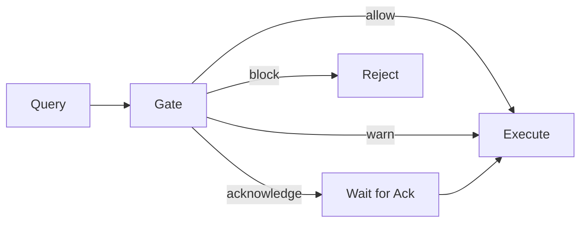

# Validation Gate

How Invariant decides whether to allow, warn, require acknowledgment, or block a query.

## Definition

The **validation gate** is the checkpoint that evaluates semantic claims about a query and decides whether to allow, warn, require acknowledgment, or block execution.

## The gate model

Every query passes through a validation gate that evaluates semantic claims:



## Why it matters

The gate ensures semantic correctness before execution, preventing misleading results from reaching users.

## Severity levels

| Level | Meaning | Behavior |
|-------|---------|----------|
| **Allow** | Query is valid | Execute immediately |
| **Warn** | Valid but includes caveats | Execute with disclosures |
| **Acknowledge** | Requires human decision | Block until acknowledged |
| **Block** | Semantically invalid | Reject with explanation |

!!! invariant-allow "Allowed"
    Query is semantically valid and can execute immediately.

!!! invariant-warn "Warn"
    Query is valid but results include disclosures about caveats.

!!! invariant-ack "Acknowledge required"
    Query requires human acknowledgment before execution.

!!! invariant-block "Blocked"
    Query is semantically invalid and cannot execute without remediation.

## Semantic claims

Validation rules evaluate **claims** about what a query does:

- "This aggregation is mathematically valid"
- "These datasets are comparable"
- "This reference system version is consistent"

When a claim fails, Invariant produces:

1. **Issue** — What went wrong
2. **Evidence** — Why it's wrong
3. **Remediations** — How to fix it

## Minimal example

```python
Disclosure(
    type=DisclosureType.PARTIAL_COMPARABILITY,
    message="Datasets have different universe definitions",
    affected_cells=[...]
)
```

Disclosures propagate through aggregations: if a source cell has a disclosure, any aggregate including that cell inherits it.

## What rules are implemented

| Rule | What it checks | Severity |
|------|----------------|----------|
| **Indicator Aggregation** | Can't SUM/AVG indicators (rates, percentages) | BLOCK |
| **Additivity** | Non-additive metrics can't be rolled up | BLOCK/WARN |
| **Universe Comparability** | Datasets with different populations need acknowledgment | REQUIRE_ACK |
| **Reference System Version** | Queries across boundary versions need crosswalks | BLOCK/WARN |
| **Time Grain** | Query grain must be in dataset's supported grains | BLOCK |
| **Geography Grain** | Rollups must be permitted by hierarchy | BLOCK |
| **Join Safety** | Prevents fanout from bad join cardinality | BLOCK/WARN |
| **Name Resolution** | All referenced metrics/dimensions must exist | BLOCK |
| **Methodology Comparability** | Different methodologies flagged | WARN |

## Not yet implemented

The following validations have infrastructure in place but rules aren't yet implemented:

| Gap | Status |
|-----|--------|
| **Unit/concept compatibility** | Variables can be linked to Concepts with `canonical_unit`, but no rule checks that you can't add USD + EUR |
| **Cross-concept aggregation** | Concepts exist to define "what this variable means", but aggregating incompatible concepts isn't blocked |

This is a known gap. The type system infrastructure exists—it just needs validation rules.

## Out of scope

| Not supported | Why |
|---------------|-----|
| **Conversions** | Converting USD→EUR or meters→kilometers requires external rate/conversion data, which violates the in-memory kernel model |
| **Custom business rules** | Invariant validates data semantics, not arbitrary business logic |
| **Data quality checks** | Null checks, range validation, etc. are downstream concerns |

The distinction: **checking compatibility** (blocking USD + EUR) is in scope and should be implemented. **Performing conversions** (turning USD into EUR) is out of scope.

## Common confusions

**"Why not just document issues in footnotes?"**

Users ignore footnotes. Disclosures are machine-readable metadata that can be surfaced in UIs, logged for audit, and processed by downstream systems.

**"Can I override blocks?"**

Some blocks can be overridden with explicit acknowledgment and elevated permissions. This is a deployment configuration.

**"Can I add custom rules?"**

The rule set is fixed in the kernel. If you need custom validation, implement it in your application layer before or after calling Invariant.

## Related examples

- [Indicator Aggregation](../examples/indicator-aggregation.md) — Block example
- [Cross-dataset Comparison](../examples/cross-dataset-comparison.md) — Acknowledge example
- [Suppression](../examples/suppression.md) — Warn example
