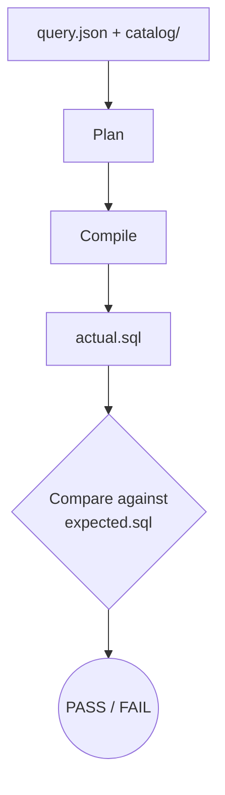

# Golden Testing for SQL Compilation

Golden tests compare compiled SQL against known-good snapshots to detect regressions. When query planning or SQL compilation changes, golden tests immediately surface the impact.

## Overview



## Fixture Structure

Each golden test fixture is a directory containing:

```
tests/integration/golden/fixtures/
└── simple_agg/
    ├── query.json          # Semantic query request
    ├── expected.sql        # Expected SQL output
    └── catalog/            # YAML assets for this test
        └── assets/
            ├── datasets/
            ├── dimensions/
            ├── geo_hierarchies/
            ├── metrics/
            └── policies/
```

### query.json

The semantic query request in JSON format:

```json
{
  "metrics": ["total_population"],
  "group_by": [
    {
      "dimension": "geography",
      "attribute": "province",
      "level": "province"
    }
  ],
  "order_by": [
    {
      "field": "total_population",
      "direction": "DESC"
    }
  ],
  "limit": 10
}
```

**Supported fields:**

| Field | Description |
|-------|-------------|
| `metrics` | List of metric names to query |
| `group_by` | Dimension groupings with optional level/grain |
| `filters` | Filter conditions with op and value |
| `order_by` | Sort specifications |
| `limit` | Row limit |
| `options` | Query options (strict, explain, allow_incomparable) |

### expected.sql

The expected SQL output. The test normalizes whitespace before comparison.

```sql
SELECT * FROM (SELECT * FROM (SELECT "province", "total_population" FROM (SELECT "province", SUM(count) AS "total_population" FROM (SELECT * FROM "census"."population_data" AS "t_population") AS _agg GROUP BY "province") AS _proj) AS _sorted ORDER BY "total_population" DESC) AS _limited LIMIT :p_0_limit
```

### catalog/

A complete set of YAML assets defining the semantic catalog for this test. Follows the standard [YAML asset structure](yaml-assets.md).

---

## Running Golden Tests

```bash
# Run all golden tests
pytest tests/integration/golden/test_golden_sql.py

# Run a specific fixture
pytest tests/integration/golden/test_golden_sql.py -k simple_agg

# Verbose output with diffs
pytest tests/integration/golden/test_golden_sql.py -v
```

### Updating Golden Files

When you intentionally change SQL compilation, update the expected files:

```bash
pytest tests/integration/golden/test_golden_sql.py --update-golden
```

This overwrites `expected.sql` with the current output. **Review the changes before committing.**

---

## Existing Fixtures

| Fixture | Description |
|---------|-------------|
| `simple_agg` | Basic SUM aggregation with grouping and ordering |
| `ratio` | Ratio metric (population density = population / land_area) |
| `derived` | Derived metric from expression |
| `multi_metric` | Multiple metrics in single query |
| `filtered` | Query with filter conditions |

---

## Creating New Fixtures

### 1. Create the directory structure

```bash
mkdir -p tests/integration/golden/fixtures/my_fixture/catalog/assets/{datasets,dimensions,geo_hierarchies,metrics,policies}
```

### 2. Define the catalog assets

Create YAML files for all required assets:

```yaml
# catalog/assets/datasets/orders.yml
name: orders
kind: FACT
physical_ref:
  schema: sales
  table: orders
grain_keys:
  geo: []
  time: [order_date]
  other: [product_id]
```

```yaml
# catalog/assets/metrics/total_revenue.yml
name: total_revenue
kind: SIMPLE_AGG
dataset_name: orders
expr: amount
agg: SUM
additivity:
  type: ADDITIVE
```

### 3. Create the query

```json
// query.json
{
  "metrics": ["total_revenue"],
  "group_by": [
    {"dimension": "time", "attribute": "month", "grain": "MONTH"}
  ]
}
```

### 4. Generate the expected SQL

```bash
# Run with --update-golden to generate expected.sql
pytest tests/integration/golden/test_golden_sql.py -k my_fixture --update-golden
```

### 5. Review and commit

Check `expected.sql` to ensure it's correct, then commit the fixture.

---

## SQL Normalization

The test framework normalizes SQL before comparison to handle formatting differences:

| Normalization | Effect |
|---------------|--------|
| Collapse whitespace | `SELECT  *  FROM` → `SELECT * FROM` |
| Remove newlines | Multi-line SQL becomes single line |
| Remove comments | `-- comment` lines removed |
| Normalize parentheses | Consistent spacing around `(` `)` |
| Normalize commas | `a,b,c` → `a, b, c` |
| Sort join conditions | `ON a AND b` always sorted alphabetically |

This allows the expected SQL to be formatted for readability while still matching functionally equivalent output.

---

## Debugging Failures

When a golden test fails, the output shows:

```
SQL mismatch for fixture 'simple_agg'.

--- Expected (normalized):
SELECT * FROM (SELECT province, total_population FROM ...

--- Actual (normalized):
SELECT * FROM (SELECT province, population FROM ...

--- Actual (raw):
SELECT *
  FROM (
    SELECT province, population
    FROM ...
  )
```

### Common causes:

| Symptom | Likely cause |
|---------|--------------|
| Column name changed | Metric or dimension rename |
| Different aggregation | Changed metric definition |
| Missing join | Dataset relationship change |
| Different table | Physical ref changed |

### Resolution:

1. If the change is intentional: `--update-golden`
2. If the change is unintentional: fix the regression

---

## Best Practices

### Keep fixtures minimal

Include only the assets needed for the specific test case:

```
# Good: Only what's needed
catalog/
└── assets/
    ├── datasets/orders.yml
    ├── metrics/revenue.yml
    └── policies/comparability.yml

# Avoid: Kitchen sink
catalog/
└── assets/
    ├── datasets/
    │   ├── orders.yml
    │   ├── products.yml      # Not used
    │   ├── customers.yml     # Not used
    │   └── inventory.yml     # Not used
```

### Test one concept per fixture

```
fixtures/
├── simple_agg/       # Basic aggregation
├── ratio/            # Ratio metrics
├── derived/          # Derived metrics
├── filtered/         # Filter handling
├── multi_metric/     # Multiple metrics
├── join_multiple/    # Cross-dataset joins
└── time_grain/       # Time grain handling
```

### Name fixtures descriptively

```
# Good
ratio_with_different_grains
filter_with_in_operator
multi_dataset_join

# Avoid
test1
my_test
foo
```

### Document edge cases in query.json

```json
{
  "metrics": ["rate"],
  "group_by": [
    {
      "dimension": "geography",
      "attribute": "name",
      "level": "ward"  // Tests finest grain level
    }
  ],
  "filters": [
    {
      "dimension": "time",
      "attribute": "year",
      "op": "IN",
      "value": [2020, 2021, 2022]  // Tests IN operator with multiple values
    }
  ]
}
```

---

## Integration with CI

Golden tests run as part of the standard test suite:

```yaml
# .github/workflows/ci.yml
- name: Run tests
  run: pytest
```

To prevent accidental `--update-golden` in CI, the flag only works locally.
