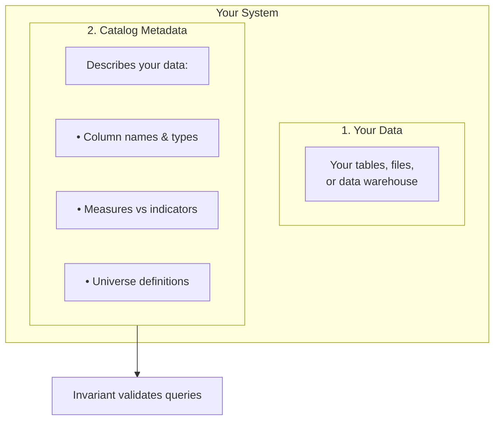
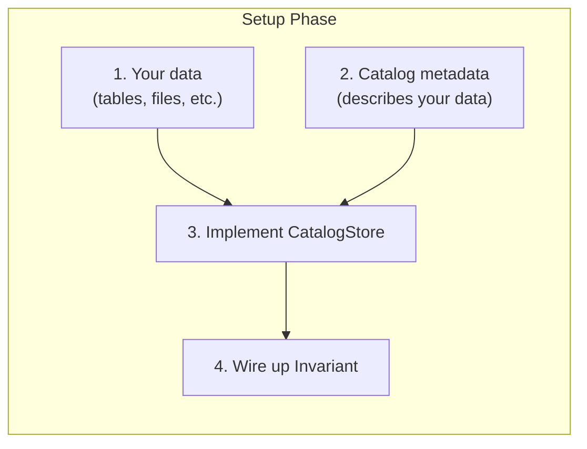
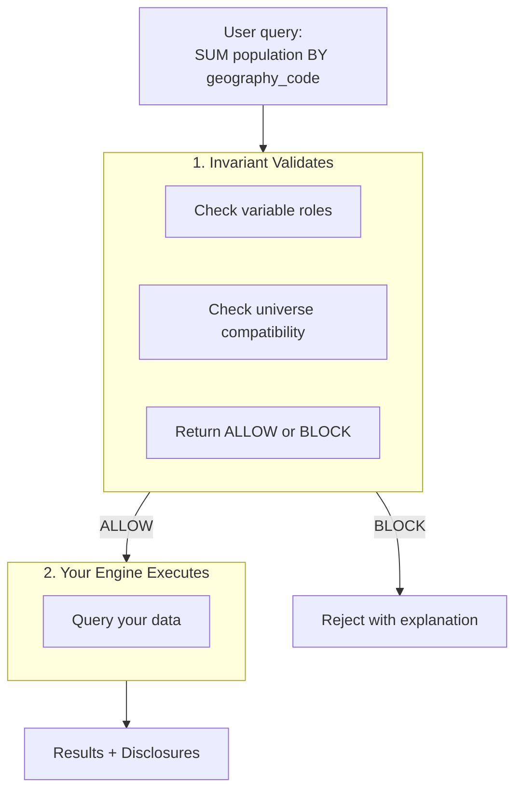

# Populating the Catalog

How data and metadata get into Invariant.

## The two things you provide

Invariant needs two separate things:



**Invariant never touches your data files.** It only reads the catalog metadata to validate queries. Your query engine executes the actual queries.

## Implementing the CatalogStore

You provide catalog metadata by implementing the `CatalogStore` port:

```python
class CatalogStore(Protocol):
    def get_data_product(self, id: DataProductId) -> DataProduct | None: ...
    def get_universe(self, id: UniverseId) -> Universe | None: ...
    def get_indicator_definition(self, var_id: VariableId) -> IndicatorDefinition | None: ...
    def get_catalog_snapshot(self, product_ids: set[DataProductId]) -> CatalogSnapshot: ...
    # ... other methods
```

**How you store the metadata is up to you.** Invariant doesn't care whether it comes from:

- A database (Postgres, SQLite)
- Configuration files (JSON, YAML)
- An external metadata API
- Hard-coded in your application

### Example implementation

```python
class YourCatalogStore:
    """Adapt your metadata storage to Invariant's interface."""

    def __init__(self, db_connection):
        self.db = db_connection

    def get_data_product(self, id: DataProductId) -> DataProduct | None:
        # Fetch from your storage
        row = self.db.query("SELECT * FROM data_products WHERE id = ?", id)
        if not row:
            return None

        # Convert to Invariant's domain objects
        return DataProduct(
            id=id,
            name=row["name"],
            kind=DataProductKind(row["kind"]),
            variables=[self._to_variable(v) for v in row["variables"]],
            grain=GrainSpec(keys=row["grain_keys"]),
        )

    def _to_variable(self, row) -> Variable:
        return Variable(
            id=VariableId(row["id"]),
            name=row["name"],
            role=VariableRole(row["role"]),  # MEASURE, INDICATOR, or DIMENSION
            data_type=DataType(row["data_type"]),
        )
```

The [sample project](../appendix/sample-project.md) includes a complete `JsonCatalogStore` implementation you can use as a reference.

## How rules get defined

**Rules aren't separate configuration.** They're implicit in your catalog metadata:

| You define... | Invariant enforces... |
|--------------|----------------------|
| `role: MEASURE` | Can be summed |
| `role: INDICATOR` | Cannot be summed |
| `role: DIMENSION` | Used for grouping only |
| `universe_id` on dataset | Datasets with different universes require acknowledgment to compare |
| `reference_system_version_id` | Queries across versions require crosswalks |
| `aggregation_policy: NOT_AGGREGATABLE` on indicator | Blocks aggregation attempts |

### Example: Defining an indicator that can't be summed

```json
{
  "data_products": [{
    "id": "...",
    "kind": "INDICATOR",
    "variables": [
      {"name": "unemployment_rate", "role": "INDICATOR", "data_type": "DECIMAL"}
    ]
  }],
  "indicator_definitions": [{
    "variable_id": "...",
    "indicator_type": "PERCENT",
    "aggregation_policy": "NOT_AGGREGATABLE",
    "numerator_variable": "unemployed_count",
    "denominator_variable": "labor_force"
  }]
}
```

Now when someone queries `SUM(unemployment_rate)`, Invariant blocks it automatically.

## The complete flow

### Setup (once)



### Runtime (every query)



## Catalog entities

| Entity | Purpose | Example |
|--------|---------|---------|
| **Study** | Top-level grouping | "Census 2021", "Labour Force Survey 2023" |
| **Dataset** | Logical table in a study | "Population by Age", "Employment by Province" |
| **Data Product** | Queryable asset with schema | Table with columns, grain, universe |
| **Variable** | Column with semantic type | `population` (MEASURE), `unemployment_rate` (INDICATOR) |
| **Universe** | Population definition | "All residents", "Working-age adults (15-64)" |
| **Reference System** | Boundary scheme with versions | "SA Municipalities 2021" |
| **Indicator Definition** | How derived values work | unemployment_rate = unemployed / labor_force |

## Next steps

- [Sample Project](../appendix/sample-project.md) — See a complete working example
- [Minimal Integration](minimal-integration.md) — Implement your first CatalogStore
- [Query Lifecycle](query-lifecycle.md) — How validation flows through the system
