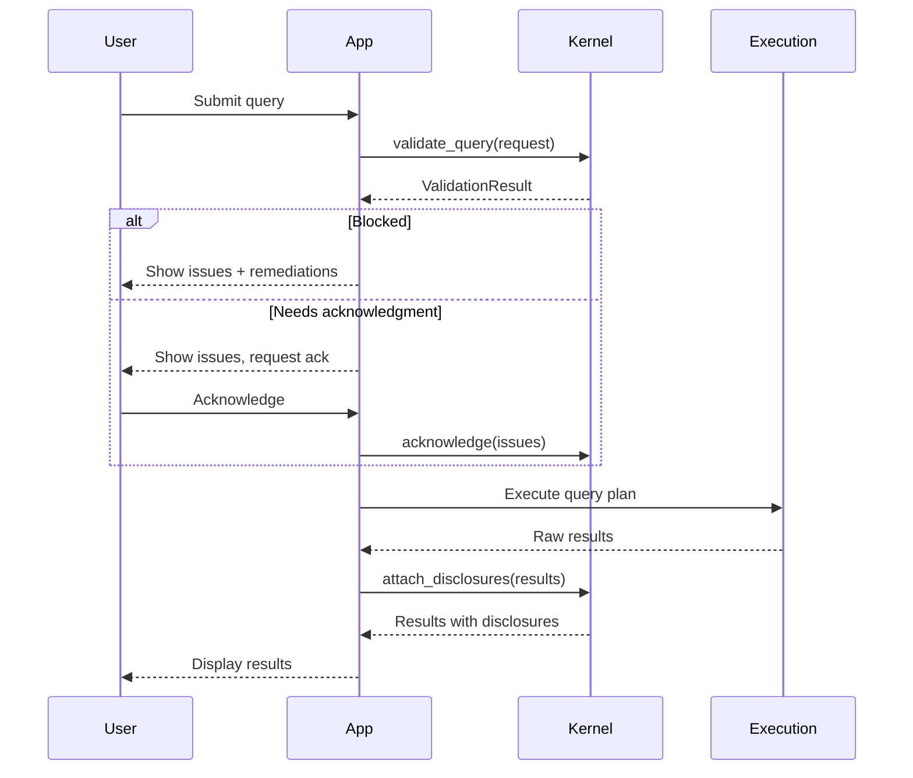

# Query Lifecycle

The full flow from query to results.

## Overview



## 1. Validate

Submit a query request and get a validation result:

```python
request = QueryRequest(
    data_product_id=product_id,
    dimensions=[region, year],
    measures=[population],
    filters=[...]
)

result = kernel.validate_query(request)
```

The result contains:

- `is_allowed` — Can proceed without intervention
- `is_blocked` — Cannot proceed
- `needs_acknowledgment` — Requires human decision
- `issues` — List of validation issues
- `disclosures` — Caveats to attach to results
- `query_plan` — Validated execution plan

## 2. Acknowledge (optional)

If the result needs acknowledgment:

```python
if result.needs_acknowledgment:
    # Show issues to user, get confirmation
    if user_confirms:
        result = kernel.acknowledge(result, acknowledged_by=user_id)
```

## 3. Execute

You execute the query plan yourself:

```python
if result.is_allowed or result.is_acknowledged:
    raw_results = my_query_engine.execute(result.query_plan)
```

Invariant doesn't execute queries — that's your execution layer's job.

## 4. Attach disclosures

After execution, attach disclosures to results:

```python
final_results = kernel.attach_disclosures(
    raw_results,
    disclosures=result.disclosures
)
```

Disclosures are machine-readable metadata that your UI can display as footnotes, warnings, or tooltips.

## Error handling

```python
result = kernel.validate_query(request)

if result.is_blocked:
    for issue in result.issues:
        print(f"{issue.severity}: {issue.message}")
        for remediation in issue.remediations:
            print(f"  → {remediation.description}")
```

## Next steps

- [Reference: Use Cases](../reference/use-cases.md) — Full API documentation
- [Reference: DTOs](../reference/dtos.md) — Request and response structures
