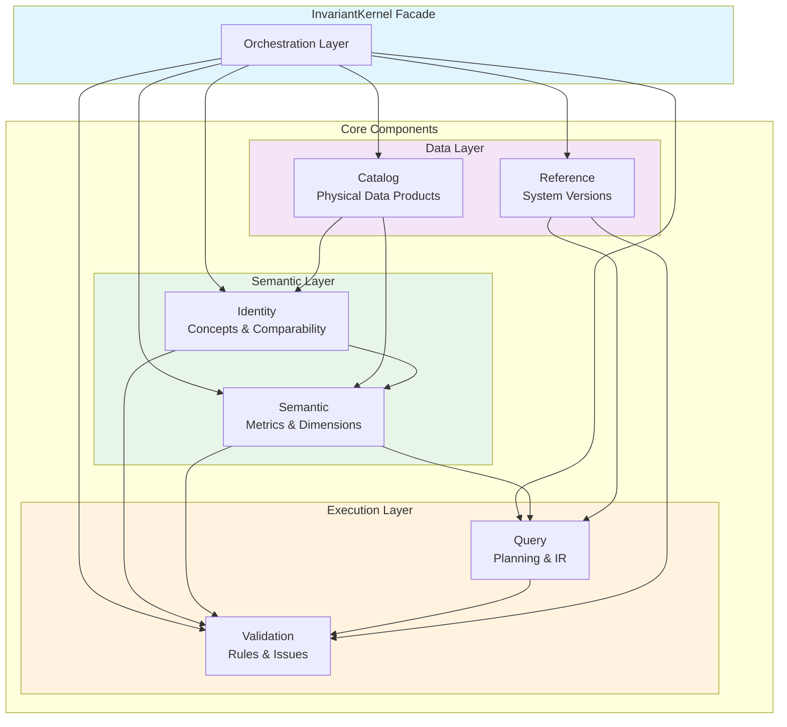
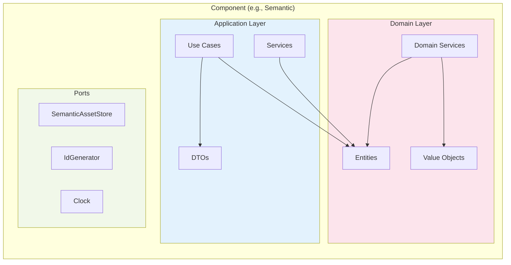
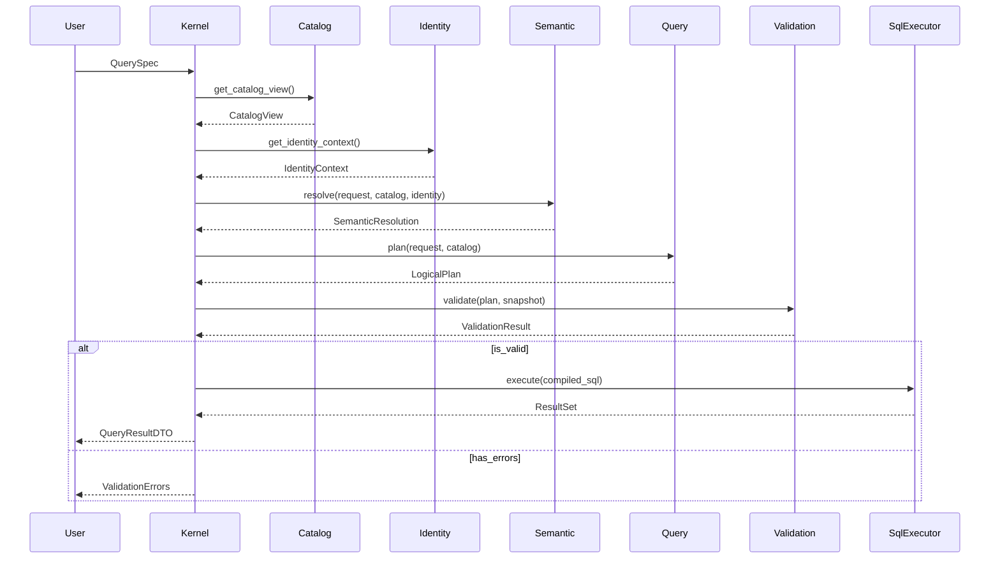
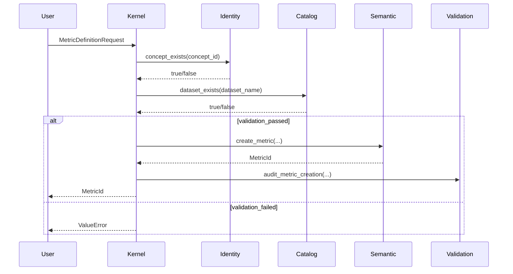
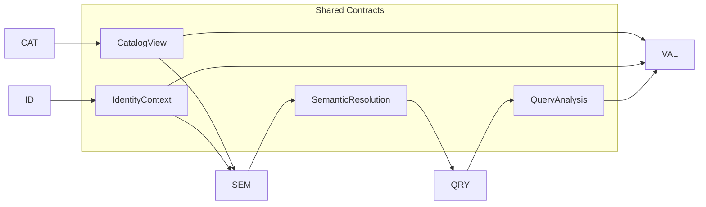
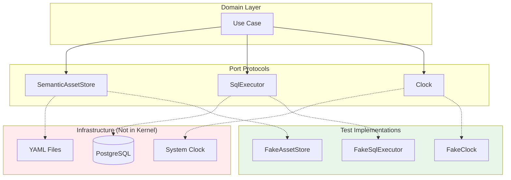
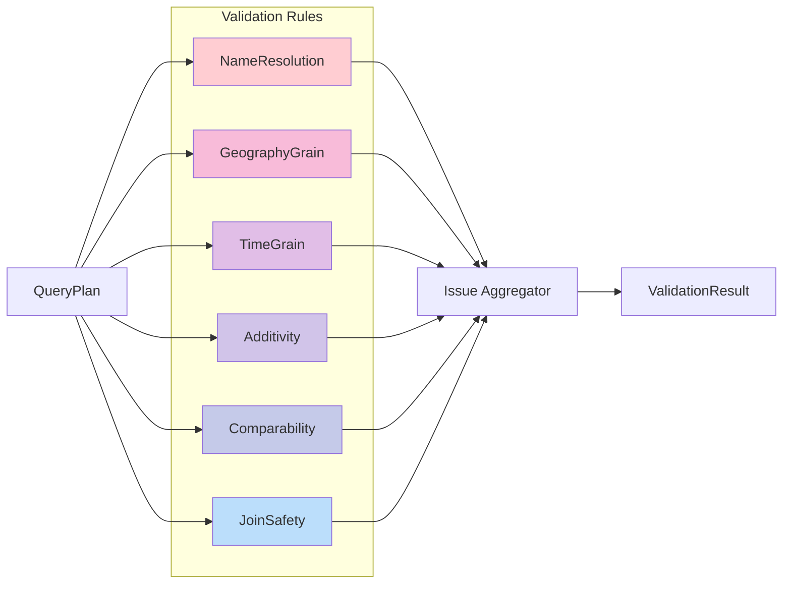
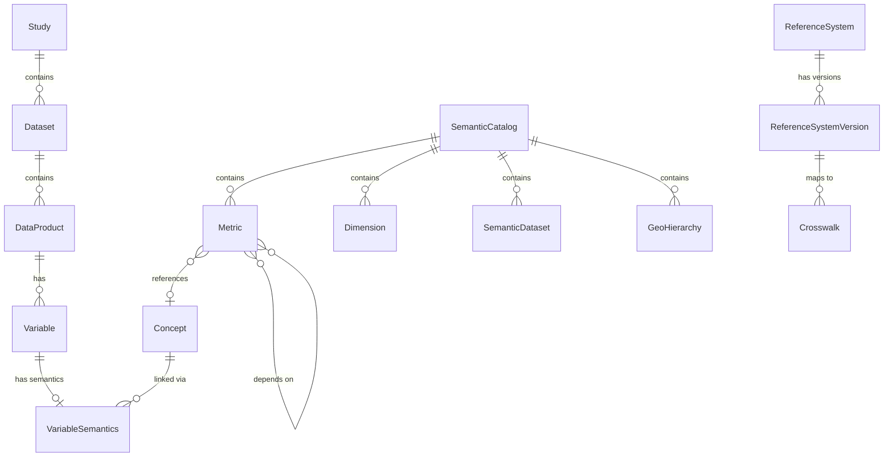
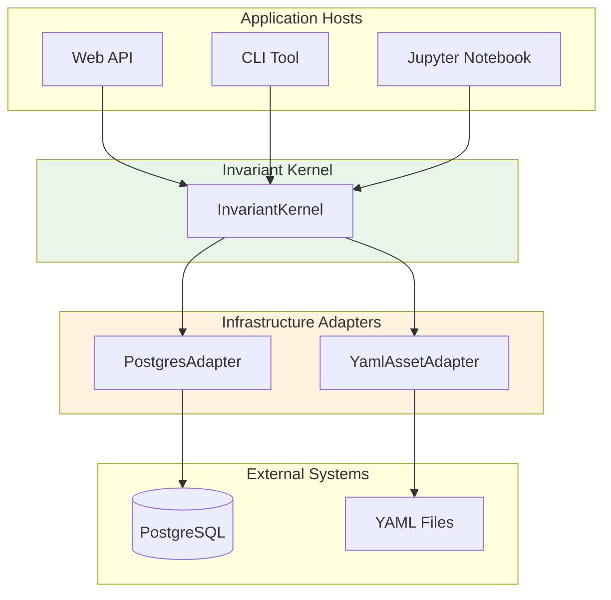

# Architecture Overview

## Component Architecture

The Invariant Analytics Kernel is organized into six loosely-coupled components, each with a single responsibility.



## Component Dependency Matrix

| Component | Catalog | Identity | Semantic | Query | Validation | Reference |
|-----------|:-------:|:--------:|:--------:|:-----:|:----------:|:---------:|
| **Catalog** | — | ✗ | ✗ | ✗ | ✗ | ✗ |
| **Identity** | refs | — | ✗ | ✗ | ✗ | ✗ |
| **Semantic** | refs | refs | — | ✗ | ✗ | ✗ |
| **Query** | ✗ | ✗ | uses | — | ✗ | refs |
| **Validation** | snapshot | context | catalog | plan | — | context |
| **Reference** | ✗ | ✗ | ✗ | ✗ | ✗ | — |

**Legend**:
- `refs` = References IDs only (opaque identifiers)
- `uses` = Uses domain objects directly
- `snapshot` = Uses read-optimized snapshot
- `context` = Uses context contract
- `plan` = Uses query plan
- `✗` = No dependency

## Layer Architecture

Each component follows the same internal layering:



### Layer Rules

| Layer | May Import | Must Not Import |
|-------|------------|-----------------|
| **Domain** | Nothing (pure) | Ports, DTOs, Infrastructure |
| **Application** | Domain, Ports, DTOs | Infrastructure |
| **Ports** | Domain types only | Application, Infrastructure |

## Data Flow

### Query Execution Flow



### Metric Definition Flow



## Shared Contracts

Components communicate through stable contracts defined in `invariant/shared/contracts/`:



### Contract Descriptions

| Contract | Owner | Consumers | Purpose |
|----------|-------|-----------|---------|
| `CatalogView` | Catalog | Semantic, Validation | Read-optimized physical structure |
| `IdentityContext` | Identity | Semantic, Validation | Concept mappings, comparability |
| `SemanticResolution` | Semantic | Query | Resolved metrics/dimensions |
| `QueryAnalysis` | Query | Validation | Structured query facts |

## Port Architecture

Ports are Protocol interfaces that abstract infrastructure:



### Key Ports

| Port | Purpose | Methods |
|------|---------|---------|
| `CatalogStore` | Catalog persistence | `get_study()`, `save_study()`, `get_data_product()` |
| `SemanticAssetStore` | Semantic catalog loading | `load_catalog()` |
| `SqlExecutor` | SQL compilation/execution | `compile()`, `execute()` |
| `Clock` | Time services | `now()` |
| `IdGenerator` | ID generation | `generate()` |
| `AuditLog` | Audit trail | `log()` |

## Validation Pipeline



### Rule Protocol

All rules implement the same interface:

```python
class Rule(Protocol):
    def evaluate(
        self,
        plan: QueryPlan,
        catalog: CatalogSnapshot
    ) -> list[Issue]: ...
```

**Rule Properties**:
- Stateless
- Deterministic
- Returns issues, never decisions
- No side effects

## Entity Relationship Diagram



## Deployment Architecture

The kernel is designed to be embedded in larger systems:



**Key Point**: The kernel itself has no dependencies on databases, file systems, or external services. All I/O is injected via ports.
